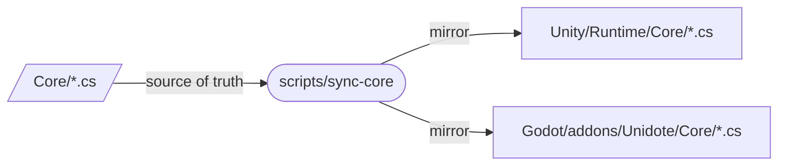
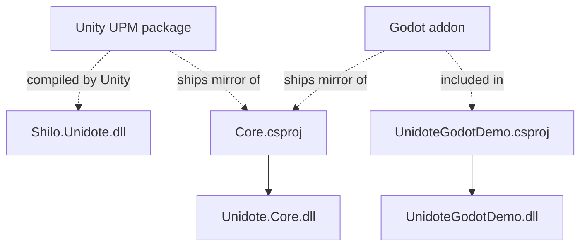

# Architecture

How Unidote is put together, and how to fork it without breaking the invariants.

## Source of truth

`/Core` is the **only** place where engine-agnostic logic is edited. The engine distribution folders are **mirrors**, not sources:



- Both mirrors are listed in `.gitignore` — editing them is discouraged and their changes get overwritten on the next sync.
- Unity `.meta` files are tracked so GUIDs survive sync runs.
- Godot does not require sidecar metadata for the mirrored files.

## Directory layout

```
unidote/
├── Core/                         # Patient Zero — netstandard2.1 class library
│   ├── Core.csproj
│   └── Unidote.cs
├── Unity/                        # UPM package (com.shilo.unidote)
│   ├── package.json
│   ├── Runtime/
│   │   ├── Unidote.asmdef
│   │   ├── UnidoteBehaviour.cs
│   │   └── Core/                 # mirror, git-ignored (meta kept)
│   └── Samples~/HelloUnidote/
├── Godot/                        # Godot 4.6+ addon
│   └── addons/Unidote/
│       ├── plugin.cfg
│       ├── UnidotePlugin.cs
│       ├── UnidoteNode.cs
│       └── Core/                 # mirror, git-ignored
├── Samples/
│   ├── UnidoteGodotDemo/         # standalone Godot project — references /Core via csproj
│   └── UnidoteUnityDemo/         # standalone Unity project — references /Unity via UPM file:
├── scripts/
│   ├── sync-core.sh
│   └── sync-core.ps1
├── docs/                         # this site
├── Directory.Build.props         # shared LangVersion + Nullable + TreatWarningsAsErrors
├── .editorconfig
├── .gitattributes
├── .gitignore
├── Unidote.sln                   # Core + UnidoteGodotDemo
├── LICENSE
└── README.md
```

## Build graph



One solution (`Unidote.sln`) covers the Core **and** the Godot demo. Both the Godot demo and Unity demo compile their respective physical engine package structures natively.

## Namespace map

| Namespace           | Location                                  | Purpose                               |
| ------------------- | ----------------------------------------- | ------------------------------------- |
| `Unidote`           | `/Core/*.cs`                              | Engine-agnostic API (source of truth) |
| `Unidote.Unity`     | `/Unity/Runtime/*.cs`                     | Unity-specific adapters               |
| `Unidote.Godot`     | `/Godot/addons/Unidote/*.cs`              | Godot-specific adapters               |
| `Unidote.Samples`   | Sample scripts in UPM and Unity demo      | Sample MonoBehaviours                 |
| `UnidoteGodotDemo`  | `/Samples/UnidoteGodotDemo/*.cs`          | Godot demo project scripts            |

## Renaming the template

After forking, you will want to rebrand the library. Touch every item below in a single commit to keep GUIDs consistent:

| File / path                                               | What to change                                          |
| --------------------------------------------------------- | ------------------------------------------------------- |
| `Core/Core.csproj`                                        | `<RootNamespace>`, `<AssemblyName>`                     |
| `Core/Unidote.cs`                                         | `namespace`, class name, `Version`                      |
| `Unity/package.json`                                      | `name`, `displayName`, `description`, `repository.url`  |
| `Unity/Runtime/Unidote.asmdef`                            | `name`, `rootNamespace`                                 |
| `Unity/Runtime/UnidoteBehaviour.cs`                       | `namespace`, class name, `AddComponentMenu`             |
| `Unity/Samples~/HelloUnidote/HelloUnidote.cs`             | `namespace`, class name                                 |
| `Godot/addons/Unidote/plugin.cfg`                         | `name`, `description`, `version`, `script`              |
| `Godot/addons/Unidote/UnidotePlugin.cs`                   | `namespace`, class name, log prefix                     |
| `Godot/addons/Unidote/UnidoteNode.cs`                     | `namespace`, class name                                 |
| `Samples/UnidoteGodotDemo/*.cs*` + `project.godot`        | namespace + `project/assembly_name`                     |
| `Samples/UnidoteUnityDemo/Packages/manifest.json`         | `com.shilo.unidote` → your id                           |
| `scripts/sync-core.*`                                     | `Godot/addons/Unidote/Core` path if addon renamed       |
| `.gitignore`                                              | addon and UPM mirror paths if renamed                   |
| `README.md`, `Unity/README.md`, `Godot/addons/Unidote/README.md`, `mkdocs.yml`, `docs/**/*.md` | copy everywhere |

!!! danger "Keep the `.meta` GUIDs unchanged"
    Regenerating Unity `.meta` GUIDs breaks scene, prefab, and asmdef references in any project that already consumes the package. The rename touches text, not identifiers.

## Versioning

Bump the semantic version in **four places** when cutting a release:

1. `Core/Unidote.cs` → `UnidoteCore.Version`
2. `Unity/package.json` → `version`
3. `Unity/CHANGELOG.md`
4. `Godot/addons/Unidote/plugin.cfg` → `version`

A future iteration can collapse these into a single `Directory.Build.props` property that feeds the others — for now, the comment in `Unidote.cs` flags the invariant.

## Invariants the CI should enforce

Two invariants are worth gating in a future CI workflow:

1. **Mirror freshness** — `scripts/sync-core.sh` produces no diff after running.
2. **Version alignment** — the four `Version` strings above match.

Neither is shipped in the template — they are optional follow-ons once the library has logic worth protecting.
