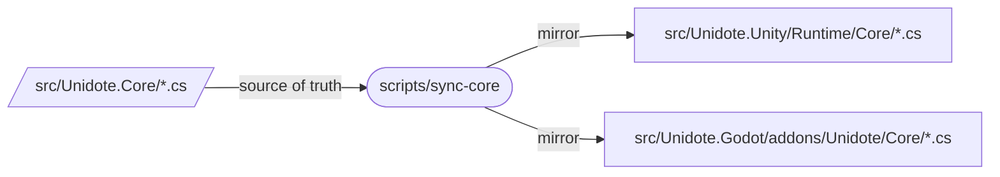
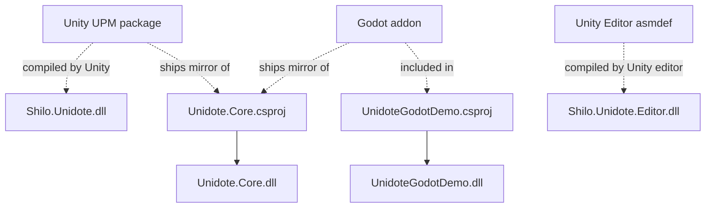
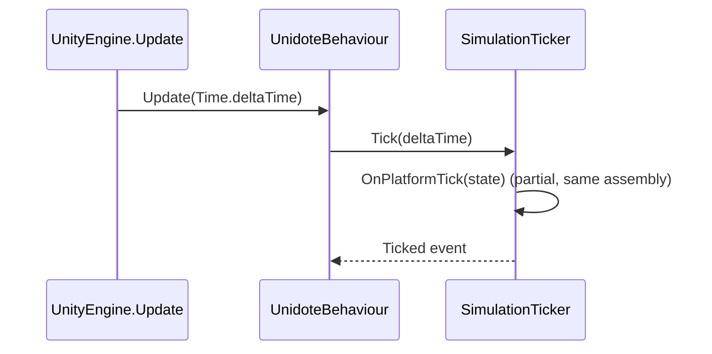

# Architecture

How Unidote is put together, and how to fork it without breaking the invariants.

## Source of truth

`src/Unidote.Core` is the **only** place where engine-agnostic logic is edited. The engine distribution folders are **mirrors**, not sources:



- All three mirrors are listed in `.gitignore` — editing them is discouraged and their changes get overwritten on the next sync.
- Unity `.meta` files are tracked so GUIDs survive sync runs.
- Godot does not require sidecar metadata for the mirrored files.
- `scripts/sync-core.*` force UTF-8 (no BOM) reads and writes and refuse to emit the classic `â€` cp1252 mojibake sequence. Re-running is idempotent.

## Directory layout

```
unidote/
├── init-project.ps1                  # one-shot rebrand: Pascal/snake/kebab rewrite + rename
├── global.json                       # .NET SDK pin
├── Directory.Build.props             # shared LangVersion, nullable, warnings-as-errors
├── Directory.Packages.props          # Central Package Management (CPM)
├── Unidote.sln                       # Core + UnidoteGodotDemo
├── src/
│   ├── Unidote.Core/                 # Patient Zero — netstandard2.1 + net8.0 class library
│   │   ├── Unidote.Core.csproj
│   │   ├── Unidote.cs                # entry point (Version, Greet)
│   │   ├── Ports/
│   │   │   └── ITickService.cs       # Bridge surface engines implement
│   │   └── Simulation/
│   │       ├── TickState.cs          # System.Numerics.Vector3 snapshot
│   │       └── SimulationTicker.cs   # partial class w/ partial OnPlatformTick
│   ├── Unidote.Unity/                # UPM package (com.shilo.unidote)
│   │   ├── package.json
│   │   ├── CHANGELOG.md
│   │   ├── LICENSE.md
│   │   ├── README.md
│   │   ├── Runtime/
│   │   │   ├── Unidote.asmdef
│   │   │   ├── UnidoteBehaviour.cs           # MonoBehaviour adapter (drives Tick from Update)
│   │   │   ├── SimulationTicker.Unity.cs     # partial-class hot-path impl
│   │   │   └── Core/                         # mirror, git-ignored (metas kept)
│   │   ├── Editor/
│   │   │   └── Unidote.Editor.asmdef         # editor-only asmdef per UPM convention
│   │   └── Samples~/HelloUnidote/
│   └── Unidote.Godot/                # Godot 4.6+ addon
│       └── addons/Unidote/
│           ├── plugin.cfg
│           ├── UnidotePlugin.cs
│           ├── UnidoteNode.cs                # Node adapter (drives Tick from _Process)
│           ├── SimulationTicker.Godot.cs     # partial-class hot-path impl
│           └── Core/                         # mirror, git-ignored
├── Samples/
│   ├── UnidoteGodotDemo/             # standalone Godot project — tracks addon mirror
│   └── UnidoteUnityDemo/             # standalone Unity project — references src/Unidote.Unity via UPM file:
├── scripts/
│   ├── sync-core.sh
│   └── sync-core.ps1
├── docs/                             # this site
├── .editorconfig
├── .gitattributes
├── .gitignore
├── LICENSE
└── README.md
```

## Build graph



One solution (`Unidote.sln`) covers the Core **and** the Godot demo. Both engine demos compile their respective physical package structures natively.

## Namespace map

| Namespace                 | Location                                           | Purpose                                      |
| ------------------------- | -------------------------------------------------- | -------------------------------------------- |
| `Unidote`                 | `src/Unidote.Core/Unidote.cs`                      | Engine-agnostic API entry point              |
| `Unidote.Ports`           | `src/Unidote.Core/Ports/*.cs`                      | Bridge interfaces the adapters implement     |
| `Unidote.Simulation`      | `src/Unidote.Core/Simulation/*.cs`                 | Core state + partial-class hot path          |
| `Unidote.Unity`           | `src/Unidote.Unity/Runtime/*.cs`                   | Unity MonoBehaviour adapters                 |
| `Unidote.Unity.Editor`    | `src/Unidote.Unity/Editor/*.cs`                    | Unity editor-only tooling                    |
| `Unidote.Godot`           | `src/Unidote.Godot/addons/Unidote/*.cs`            | Godot Node adapters                          |
| `Unidote.Samples`         | `src/Unidote.Unity/Samples~/**/*.cs`               | Sample MonoBehaviours (Package Manager)       |
| `UnidoteGodotDemo`        | `Samples/UnidoteGodotDemo/*.cs`                    | Godot demo project scripts                   |

## The Bridge pattern in practice



Godot is symmetric — `UnidoteNode._Process(delta)` calls the same `SimulationTicker.Tick`.

The `OnPlatformTick` extension is a C# **partial method**. Because the sync pipeline mirrors the Core into each engine's adapter assembly, the partial body declared in `SimulationTicker.Unity.cs` or `SimulationTicker.Godot.cs` is compiled into the *same* assembly as the Core — no interface dispatch, no virtual call, no delegate allocation per tick.

## Renaming the template

`init-project.ps1` at the repo root does the mechanical rewrite automatically. It derives three casings from your project name:

| Casing        | Replaces       | Used by                                                      |
| ------------- | -------------- | ------------------------------------------------------------ |
| PascalCase    | `Unidote`      | C# namespaces, type names, Unity `AddComponentMenu` entries  |
| snake_case    | `unidote`      | Godot plugin IDs, internal folder names, UPM ids             |
| kebab-case    | `unidote-id`   | PWA manifest ids, npm/web package names (if you add any)     |

All three passes use case-sensitive (`-creplace`) replacements so the PascalCase sweep does not eat lowercase tokens.

!!! danger "Keep the `.meta` GUIDs unchanged"
    Regenerating Unity `.meta` GUIDs breaks scene, prefab, and asmdef references in any project that already consumes the package. The rename touches text and file names, not identifiers.

## Versioning

Bump the semantic version in **four places** when cutting a release:

1. `src/Unidote.Core/Unidote.cs` → `UnidoteCore.Version`
2. `src/Unidote.Unity/package.json` → `version`
3. `src/Unidote.Unity/CHANGELOG.md`
4. `src/Unidote.Godot/addons/Unidote/plugin.cfg` → `version`

A future iteration can collapse these into a single `Directory.Build.props` property that feeds the others — for now, the comment in `Unidote.cs` flags the invariant.

## Invariants the CI enforces

`.github/workflows/sync-check.yml` runs on every push to `main` and every PR:

1. **Mirror freshness** — `scripts/sync-core.sh` produces no diff against tracked mirrors.
2. **UTF-8 integrity** — no cp1252→UTF-8 mojibake (`â€` prefix) in source or mirrors.
3. **Engine isolation** — `src/Unidote.Core` contains zero references to `UnityEngine`, `UnityEditor`, `Godot`, or `GodotSharp`.

Version alignment across the four files above is a manual check today; promote to CI when the first non-trivial release cuts.
