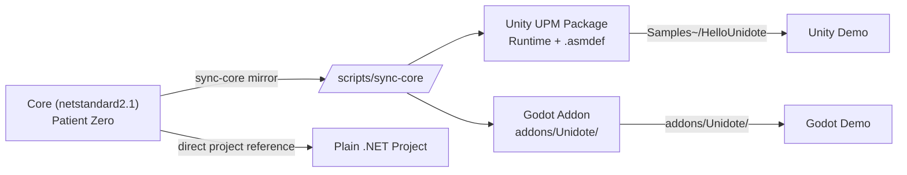

# Unidote

  **Cure for cross-engine headaches.** A minimal C# scaffold with an engine-agnostic core plus Unity and Godot wrappers.

[Install :material-download:](install.md){ .md-button .md-button--primary }
[Quick start :material-rocket-launch:](quick-start.md){ .md-button }
[Source on GitHub :fontawesome-brands-github:](https://github.com/Shilocity/unidote){ .md-button }

---

## Symptoms this treats

- Copy-pasting the same game logic between Unity and Godot.
- Engine-specific boilerplate leaking into your gameplay code.
- "Source of truth" drift between engine ports.
- Rebuilding UPM packages and Godot addons from scratch for every new library.

## Active ingredients

- **Patient Zero** — a `netstandard2.1` class library with zero engine dependencies.
- **Unity Adapter** — a UPM package (`package.json` + `Runtime/*.asmdef`) installable via Git URL.
- **Godot Addon** — a Godot 4.6+ C# plugin, drop-in to any `addons/` folder.
- **Sync Scripts** — `sync-core.sh` + `sync-core.ps1` mirror the Core into each engine's distribution folder.
- **Minimal Samples** — a `Hello World` per engine that references `/Core` with zero drift.

## Supported engines

| Engine | Minimum Version | Runtime                  |
| ------ | --------------- | ------------------------ |
| Unity  | **6.4+** (`6000.4`) | Mono / IL2CPP        |
| Godot  | **4.6+** (.NET build) | .NET 8 / net8.0    |
| .NET   | `netstandard2.1` | .NET 6+, Mono, Unity, Godot |

!!! note "Technically compatible with earlier releases"
    The Core library targets `netstandard2.1` so it runs on older engine versions, but the scaffold is tested and supported against the versions above.

## When to use Unidote

-   :material-source-branch:{ .lg .middle } **Cross-engine libraries**

    ---

    Build a reusable library (AI, procgen, save system, input layer) that ships to Unity **and** Godot from a single codebase.

-   :material-test-tube:{ .lg .middle } **Engine-agnostic gameplay prototypes**

    ---

    Keep gameplay logic independent of any engine so you can benchmark Unity vs Godot mid-project without a rewrite.

-   :material-package-variant:{ .lg .middle } **Asset Store / Asset Library products**

    ---

    Ship the same library to the Unity Asset Store and the Godot Asset Library with matching APIs and a single test suite.

-   :material-shield-check:{ .lg .middle } **Vendor-lock insurance**

    ---

    Reduce the blast radius of engine policy changes, pricing shifts, or deprecations by keeping your logic portable.

## Philosophy in one slide

Edit anything under `/Core`. Run the sync script. Both engine distributions pick up the change. No drift, no duplication.

## Next steps

1. [Install](install.md) the scaffold into a new or existing repo.
2. Run the [Quick Start](quick-start.md) to confirm both engine samples print the Unidote greeting.
3. Drill into the [Unity](engines/unity.md), [Godot](engines/godot.md), or [.NET](engines/dotnet.md) guide for your engine of choice.
4. Read the [Architecture](architecture.md) page before you rename the namespace and start adding your logic.
