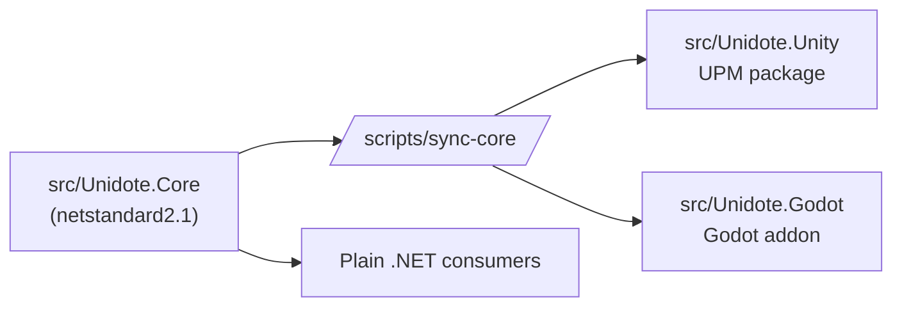

# Unidote

Cure for cross-engine headaches. A minimal engine-agnostic C# scaffold for building cross-engine libraries for Unity and Godot.

[Quick Start :material-rocket-launch:](quick-start.md){ .md-button .md-button--primary }
[Unity Setup :material-unity:](unity-setup.md){ .md-button }
[Godot Setup :material-robot:](godot-setup.md){ .md-button }
[Source :fontawesome-brands-github:](https://github.com/shilo/unidote){ .md-button }

---

## What this is

A GitHub template. Clone it, rebrand it with `scripts/init.sh`, add your business logic to `src/Unidote.Core`, and publish to Unity UPM and Godot Asset Library with zero duplicated code.

## What this is not

A framework. There are no ready-made features, no runtime, no utilities. You get:

- An empty `netstandard2.1` Core project (`src/Unidote.Core`).
- A Unity UPM package skeleton (`src/Unidote.Unity`) with `package.json` + `.asmdef`.
- A Godot 4.6+ addon skeleton (`src/Unidote.Godot`) with `plugin.cfg` + `.csproj`.
- Sync scripts that mirror Core sources into both engine distributions.
- Minimal host projects under `samples/` for smoke-testing each engine.

## Supported runtimes

| Target | Version        | Notes         |
| ------ | -------------- | ------------- |
| .NET   | netstandard2.1 | Core target   |
| Unity  | 6.4+ (6000.4)  | Mono / IL2CPP |
| Godot  | 4.6+ (.NET)    | net8.0 host   |

## Layout at a glance

Edit Core. Run sync. Both engine distributions pick up the change.

## Where to go next

1. [Quick Start](quick-start.md) — clone, rebrand, add logic, mirror.
2. [Development Workflow](development-workflow.md) — forward and reverse sync between `src/` and `samples/` while developing.
3. [Unity Setup](unity-setup.md) — wire the UPM package into a Unity project.
4. [Godot Setup](godot-setup.md) — register the addon in a Godot project.
